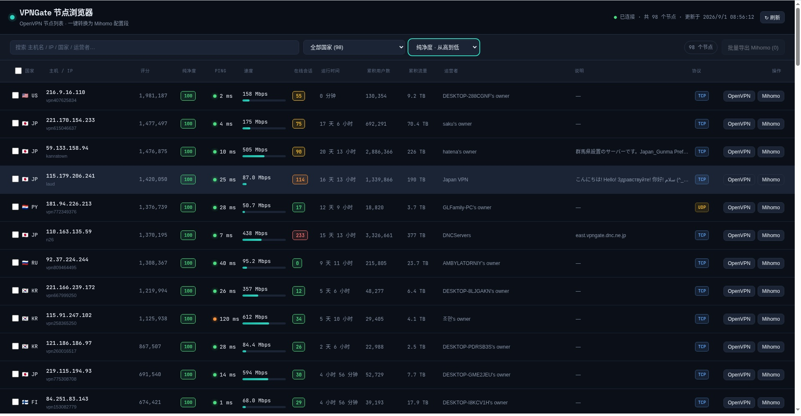
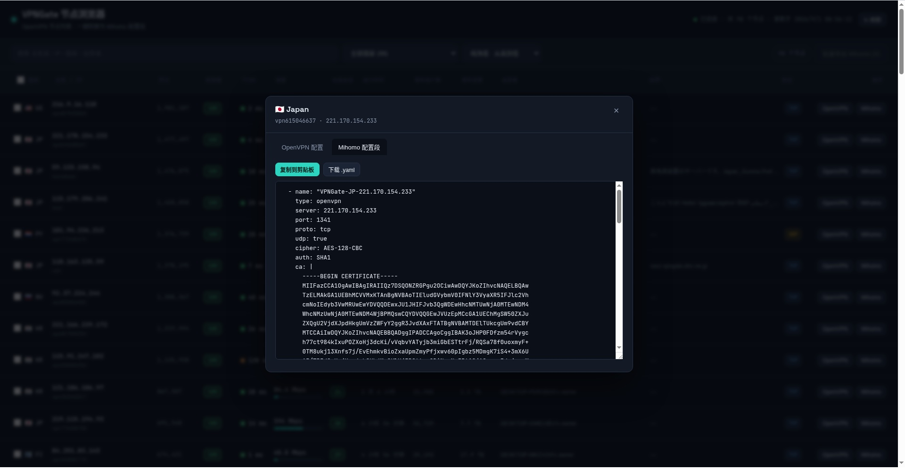
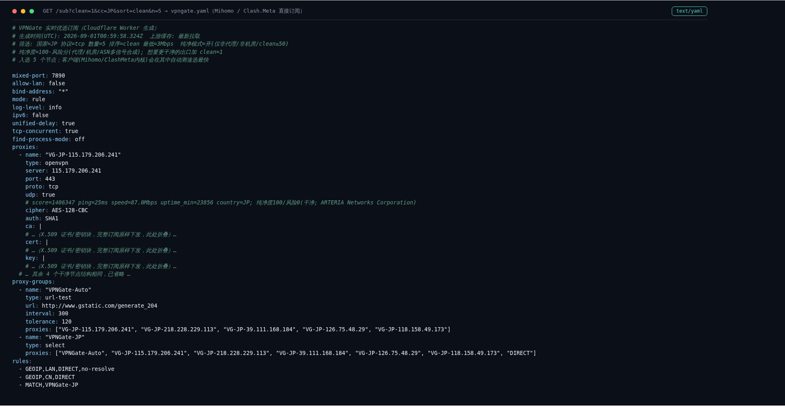

# VPNGate Clean Mihomo · 纯净度感知的 VPNGate 实时优选订阅

<p align="center">
  <b>简体中文</b> · <a href="README_EN.md">English</a> · <a href="README_FA.md">فارسی</a>
</p>


一个**单文件 Cloudflare Worker**：实时抓取 [VPN Gate](https://www.vpngate.net)（筑波大学学术实验项目）的公共 OpenVPN 节点，
**自动检测每个出口 IP 的“纯净度 / 欺诈风险”**，在网页上浏览筛选，并直接输出一份可订阅的
[Mihomo（Clash.Meta 内核）](https://wiki.metacubex.one/config/proxies/openvpn/) 配置——支持“只给干净住宅 IP”的纯净订阅。

另外提供一套**可选的 VPS 转换层**（`vps-relay/`）：在你自己的服务器上用 OpenVPN + 策略路由把流量固定从
“自动优选出的低风险日本住宅 IP”转出，并带看门狗自动故障切换，客户端入口永不改变。

> 本项目衍生自 [RememberOurPromise/OpenVPNGate4Mihomo](https://github.com/RememberOurPromise/OpenVPNGate4Mihomo)（Unlicense / 公共领域），
> 在其“浏览 + 单节点转换”的基础上新增了 **IP 风险画像、纯净订阅、整份可订阅配置、VPS 自动优选出口** 等能力，详见 [致谢](#-致谢)。

---

## 🖼️ 效果演示

**① 节点浏览器：按“纯净度”排序，干净的住宅 / 运营商 IP（绿色 100）排在最前，已知代理 / 机房标红：**



**② 一键把任意节点转换为 Mihomo（Clash.Meta）配置段，可复制或下载：**



**③ `/sub?clean=1` 直接输出完整可订阅配置——每个节点标注纯净度，内置 url-test 自动测速组（下图证书块已折叠）：**



---

## ✨ 特性

### 相比原项目新增
- 🧼 **IP 纯净度 / 欺诈风险引擎**：对每个节点 IP 综合 `代理标记 / 机房托管 / 移动网络 / ASN&ISP 关键词 / 业务类型` 多信号打分，
  输出 `0–100` 的风险分 `risk` 与纯净分 `clean = 100 - risk`，分 `干净 / 中等 / 高风险` 三档。
- 🎯 **纯净订阅模式**：`clean=1` 只保留“非已知代理、非机房、clean≥50”的住宅 / 运营商 IP；`maxrisk` 可设风险上限。
- 🔁 **整份可直接订阅的配置**：`/sub` 直接输出含 `proxies + proxy-groups(url-test 自动测速) + rules` 的完整 Mihomo 配置，
  客户端填一个 URL 即可，无需手动拼。原项目只在浏览器里转换单个节点。
- 🛡️ **输出加固**：对来自第三方的自由文本（ISP、主机名、自定义分组名等）统一做控制字符清洗，防止 YAML 断行注入。
- 🖥️ **可选 VPS 转换层**：固定客户端入口 + 后台自动优选干净出口 + 看门狗故障切换 + IPv6 黑洞防泄漏。
- ⚡ 质量画像 6 小时内存缓存、节点列表边缘缓存；质量源故障自动降级，**绝不阻断出节点**。无需 KV / D1 / 环境变量。

### 继承自原项目
- 节点浏览器：国家旗帜、主机/IP、评分、Ping 色点、速度条、在线人数、运行时长、流量、运营者、说明、TCP/UDP 徽章；
  搜索 / 国家筛选 / 排序 / 固定表头 / 窄屏卡片化。
- 单节点 OpenVPN ↔ Mihomo 配置段互转，异常取值（tap、罕见 cipher、tls-auth 等）给出兼容性提示；支持批量导出。

---

## 🧩 工作原理

```
                         ┌──────────────────────────── Cloudflare Worker ───────────────────────────┐
 VPNGate 官方 CSV ──────▶│ 解析节点 → 提取出口IP → IP质量画像(ip-api 批量,缓存6h) → 打分 clean/risk  │
 (www.vpngate.net/api)   │                                                                          │
                         │   GET /            节点浏览器(表格带“纯净度”列)                           │
                         │   GET /api/servers 全部节点 JSON(带 quality 字段)                        │
                         │   GET /sub         按参数筛选/排序 → 完整 Mihomo 订阅(逐节点标注风险)     │
                         └──────────────────────────────────────────────────────────────────────────┘
                                                              │ 纯净订阅 URL
                                                              ▼
                                              Mihomo / ClashMeta 客户端自动测速选优

 （可选）VPS 转换层 vps-relay/：
   客户端 ─固定入口(VLESS/Reality 等)─▶ 你的 VPS ─fwmark 策略路由─▶ OpenVPN(tun0) ─▶ 优选出的干净住宅 IP ─▶ 互联网
                                                    ▲
            bestip 定时刷新候选池(纯净优先,官方集群兜底) + watchdog 连续2次不健康才平滑切换
```

### 纯净度评分规则（`assessQuality`）
| 信号 | 风险加权 |
|---|---|
| 已知公开代理 `proxy=true` | +45 |
| 机房 / 托管 `hosting=true` | +25 |
| 业务类型为 `business` | +6 |
| ISP/ORG/AS 命中托管/VPN 关键词 | +15 |
| 移动网络 `mobile=true` | −20（更接近真实住宅） |
| 普通住宅 ISP（非代理非机房） | 风险封顶 10 |

- `clean = 100 - risk`；`clean≥80` 干净 / `50–79` 中等 / `<50` 高风险。
- 数据来自 [ip-api.com](http://ip-api.com) 免费批量接口（仅 http、15 次/分、单次≤100 IP，Worker 已做批量合并与缓存）。
- VPNGate **官方日本集群（219.100.37.x，SoftEther 研究机构 ASN）几乎全部 `proxy=true`**，速度极快但属于知名公共代理、
  风控网站容易判高风险；而少量民间挂出的住宅 / 运营商 IP 通常更“干净”但速度在线率有波动——本项目用“干净优先 + 官方兜底”平衡二者。

---

## 🚀 快速开始（只用 Worker，5 分钟）

### 方式 A：控制台粘贴（零依赖）
1. 登录 [Cloudflare Dashboard](https://dash.cloudflare.com/) → Workers & Pages → 创建 Worker。
2. 把 [`worker/worker.js`](worker/worker.js) 全部内容粘贴进在线编辑器，部署。
3. 访问分配的 `*.workers.dev` 地址即可看到节点浏览器。

### 方式 B：Wrangler CLI
```bash
cd worker
cp wrangler.toml.example wrangler.toml   # 可改 name / 自定义域名
npm i -g wrangler && wrangler login
wrangler deploy
```

### 拿到订阅链接（Mihomo / ClashMeta 内核）
```text
# 速度优先（默认，逐节点在注释里标注纯净度/风险）
https://你的域名/sub

# 纯净优先：只要日本、干净住宅 IP、按纯净度排序（推荐）⭐
https://你的域名/sub?clean=1&cc=JP&sort=clean
```
把该 URL 作为订阅地址加进 Mihomo 内核客户端（Mihomo Party / Clash Verge Rev / FlClash / NekoBox 等）即可。

---

## 🔌 订阅参数（`/sub`，别名 `/mihomo` `/clash` `/subscribe`）

| 参数 | 取值 | 默认 | 说明 |
|---|---|---|---|
| `n` | 1–30 | 8 | 返回节点数量 |
| `cc` | 两位国家码 | 全球 | 如 `JP`/`KR`/`US` |
| `proto` | `tcp`/`udp`/`any` | `tcp` | OpenVPN 传输协议，tcp 更稳 |
| `sort` | `score`/`speed`/`ping`/`clean` | `score` | 排序方式，`clean`=最干净在前 |
| `min` | Mbps | 3 | 最低速度门槛 |
| `clean` | `1` | 关 | 纯净模式：仅非代理/非机房且 clean≥50 |
| `maxrisk` | 0–100 | 不限 | 风险分上限，如 `maxrisk=30` |
| `name` | 字符串 | VPNGate | 选择组名称 |
| `refresh` | `1` | – | 绕过缓存强制重新拉取上游 |

示例：只要日本、10 个、风险≤30、按纯净度排序：
```text
https://你的域名/sub?cc=JP&n=10&maxrisk=30&sort=clean
```

### API
- `GET /api/servers`：全部节点 JSON，每个节点附带 `quality: {clean,risk,grade,proxy,hosting,mobile,isp,...}`，支持 `?refresh=1`。

---

## 🖥️（可选）VPS 转换层：固定入口 + 自动优选干净出口

适合“想让客户端配置永远不变、由服务器后台自动挑选并切换低风险出口”的场景。完整步骤见
[`vps-relay/README.md`](vps-relay/README.md)。它会：

- 定时从你的 Worker 拉带纯净度的节点列表，**纯净优先**生成候选池，末尾保留官方集群兜底（永不彻底断连）；
- 用 OpenVPN 建 tun 隧道 + `fwmark` 策略路由，只让指定入站流量走隧道，其余服务不受影响；
- 看门狗每 2 分钟健康探测，**连续 2 次失败**才平滑切到实时榜首，避免榜单抖动造成周期性断流；
- IPv6 黑洞、松散 rp_filter、主线路泄漏检测（隧道出口若等于主网卡 IP 即判不健康）。

---

## 📁 目录结构
```
.
├── worker/
│   ├── worker.js                 # 单文件 Worker（节点浏览器 + API + 订阅 + 质量引擎）
│   └── wrangler.toml.example
├── vps-relay/                    # 可选：VPS 自动优选 + 固定入口转换层
│   ├── bestip_refresh.py         # 纯净优选器（Worker 优先，官方 CSV 兜底）
│   ├── build_running.sh          # 由候选拼出 running.ovpn（缺失时自举）
│   ├── ovpn-up.sh / ovpn-down.sh # 策略路由 up/down（v4+v6）
│   ├── watchdog.sh               # 健康检查 + 故障切换
│   ├── bestip_refresh.sh         # flock 互斥包装
│   ├── vpngate.env.example       # 运行配置模板（国家/纯净模式/Worker 地址）
│   ├── systemd/                  # service / timer 单元
│   └── sysctl/                   # rp_filter 示例
├── LICENSE
└── README.md
```

---

## 🙏 致谢

- **[RememberOurPromise/OpenVPNGate4Mihomo](https://github.com/RememberOurPromise/OpenVPNGate4Mihomo)** —— 本项目的起点。
  其 Worker 抓取解析、OpenVPN→Mihomo 字段映射思路与节点浏览器前端在本项目中被沿用与扩展（原项目采用 The Unlicense / 公共领域）。
- **[VPN Gate Academic Experiment](https://www.vpngate.net)**，日本筑波大学（University of Tsukuba）的公益公共 VPN 学术项目，由全球志愿者提供节点。
- **[Mihomo（Clash.Meta）](https://github.com/MetaCubeX/mihomo)** 及其 [OpenVPN 配置文档](https://wiki.metacubex.one/config/proxies/openvpn/)。
- IP 画像数据来自 [ip-api.com](https://ip-api.com)。

## 👥 Authors
本项目由 [**@ZJH233-tech**](https://github.com/ZJH233-tech) 与 **Doubao AI** 共同设计、开发与调试完成。

## ⚠️ 免责声明
- VPN Gate 是大学学术实验项目，公共节点由第三方志愿者提供，**可用性、速度、纯净度随时波动**，请自行承担使用风险。
- “纯净度/风险分”仅依据公开可查的 IP 类型信号做启发式评估，**不构成对节点安全性、合法性或匿名性的保证**；
  即使评分干净，也**不要**通过公共中继登录支付、银行等敏感账号。
- 请遵守你所在国家 / 地区及出口节点所在地的法律法规，本项目仅供学习与网络研究使用。
- 本项目与 VPN Gate、Cloudflare、ip-api、Mihomo 均无官方关联。

## 📄 License
[MIT](./LICENSE)。衍生自 Unlicense（公共领域）的原项目，衍生部分以 MIT 发布。
